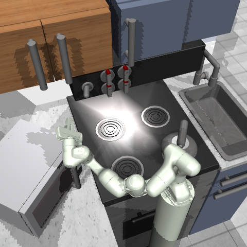

# `KitchenShift`, a fork of `adept_envs` with improvements like additional functionality for worldgen.

## Quickstart (with Mujoco)

We use `python==3.9`. Go through the process of installing [`dm_control`](https://github.com/deepmind/dm_control#requirements-and-installation) first. Make sure you also go through the Rendering section.

```
pip install -r requirements.txt
pip install -e .
```

```
export MUJOCO_GL=egl
export EGL_DEVICE_ID=0
```

```
import kitchen_shift
import gym

env = kitchen_shift.Kitchen_v1(camera_id=6)

# or

env = gym.make('kitchen-v1', camera_id=6)
```

## Changelog

- *coming soon: PyPI package*
- 08/28/21: Initial release

## Comparison to the original codebase

The released [`adept_envs`](https://github.com/google-research/relay-policy-learning/blob/master/adept_envs/adept_envs/franka/kitchen_multitask_v0.py) environment code (#cd70ac) resets simulator state in a deterministic fashion, see [here](https://github.com/google-research/relay-policy-learning/blob/cd70ac9334f584f86db281a1ffd3e5cbc3e5e293/adept_envs/adept_envs/franka/kitchen_multitask_v0.py#L135) and [here](https://github.com/google-research/relay-policy-learning/blob/cd70ac9334f584f86db281a1ffd3e5cbc3e5e293/adept_envs/adept_envs/franka/robot/franka_robot.py#L216).

This is undesirable because the underlying Mujoco simulation could step near deterministically for different instances of the environment depending on the given actions, which can unintentionally inflate policy performance during evaluation.

General practice is to add some noise to the simulator reset state, see [Gym](https://github.com/openai/gym/blob/4ede9280f9c477f1ca09929d10cdc1e1ba1129f1/gym/envs/mujoco/ant.py#L48) and [Robo](https://github.com/google-research/robodesk/blob/a8edde34f879242730c026dfe7c6e3beb4318023/robodesk/robodesk.py#L228)[Desk](https://github.com/google-research/robodesk/blob/a8edde34f879242730c026dfe7c6e3beb4318023/robodesk/robodesk.py#L199).

> Sidenote: We have opted to use the new [np.random.Generator](https://numpy.org/doc/stable/reference/random/generator.html). See [this](https://old.reddit.com/r/MachineLearning/comments/mocpgj/p_using_pytorch_numpy_a_bug_that_plagues/) and [this](https://www.pcg-random.org/rng-basics.html) for additional discussion on RNG. We use SFC64 instead of PCG64 as the bit generator, see [this issue](https://github.com/numpy/numpy/issues/16313) for context on why. Using the original np.random and np.random.RandomState should also be done with care as it is not process-safe.  

We take two approaches to apply noise perturbations to the initial state of the simulation. We add a small amount of random noise to the initial state and also step the simulator a random number of times, immediately after resetting the environment.

Below we attempt to list all the changes from the original environment code:
- Added additional functionality for worldgen (Note: To implement this, we had to change the object ordering in the simulator state.)
- Stochastic initialization (noise added to initial state and random number of simulator steps when resetting)
- Refactoring to remove unused legacy code that supported hardware
- Fixed Franka robot limits
- Using noslip solver
- Rendering optimizations by resizing texture assets

## Borrowed assets
- [microwaves, kettles, trashbin] from https://github.com/vikashplus/furniture_sim
- [xarm7] from https://github.com/yuqingd/sim2real2sim_rad/tree/master/environments/kitchen/adept_envs/adept_envs/xarm/assets

## Getting demonstrations data

The [original](https://github.com/google-research/relay-policy-learning/blob/cd70ac9334f584f86db281a1ffd3e5cbc3e5e293/kitchen_demos_multitask.zip) demonstrations data was captured by having a human control the simulated robot with VR and mocap constraints.

We provide a filtered [version]() of that dataset which removes some of the unuseable or duplicate files.

## Generating trajectories (optional)

We seed the environments used to generate the demo trajectories, and different parameters, thresholds, or changes in noise to the simulation will change the generated trajectories. This may impact policy learning, even though the generated demo videos look fine.

We provide the generated demonstrations used in our experiments [here](), and also supply the log outputted when we generated the demonstrations. If you are re-generating the demonstrations, make sure that the log outputs are exact or similar enough. We tried to keep simulation parameters and behavior similar to the original environment, in order to generate demos that match the original release.

```
MUJOCO_GL=egl EGL_DEVICE_ID=0 python -u process_demos.py \
--CAMERA_ID 6 \
--RENDER_SIZE 256 256 \
--ROBOT franka2 \
--RNG_TYPE generator \
--NUM_WORKERS 12 --LOG 0 \
--CTRL_MODE abspos \
--OUT_DIR workdir/0818c6r256_abspos
```

## Baselines

If you are interested in baseline algorithms and policy learning results using KitchenShift, please check out our accompanying codebase, [`domain-shift-benchmark`](https://github.com/etaoxing/domain-shift-benchmark).

## Worldgen

We provide a `gym.Wrapper` to add [worldgen](https://github.com/openai/mujoco-worldgen) functionality by modifying the XML file parsed by Mujoco. We use this function to apply independent types of domain shifts to the environment, see `show_worldgen.py`. 


These worldgen functions could also be composed, for example:

```
import numpy as np
import kitchen_shift
import gym

rs = (480, 480)
env = gym.make(
    'kitchen-v1',
    camera_id=6,
    render_size=rs,
)
env = kitchen_shift.MujocoWorldgenKitchenEnvWrapper(env)

domain_params = [
    ('change_microwave', 3),
    ('change_kettle', 5),
    ('change_camera', 2),
    ('change_objects_layout', 'microwave', 'closer_angled'),
    ('change_objects_layout', 'kettle', 'bot_right_angled'),
    ('change_hinge_texture', 'wood1'),
    ('change_floor_texture', 'white_marble_tile'),
    ('change_object_done', 'switch'),
    ('change_robot_init_qpos', [-1.18, -1.76, 1.43, -1.57, -0.1, 0.88, 2.55, 0.0, -0.0]),
]

env.reset_domain_changes()
for p in domain_params:
    fn = getattr(env, p[0])
    fn(*p[1:])
env.reset(reload_model_xml=True)

for _ in range(1):
    state, reward, done, info = env.step(np.zeros(env.action_space.shape[0]))

import cv2

img = env.render(mode='rgb_array', height=rs[0], width=rs[1])
cv2.imwrite('assets/compose_worldgen_example.png', img)

env.reset()  # domain shifts are still applied

env.reset_domain_changes()
env.reset(reload_model_xml=True)  # back to the default training domain
```




## References

[1] [Relay Policy Learning](https://github.com/google-research/relay-policy-learning)

```
@inproceedings{gupta2020relay,
  title={Relay Policy Learning: Solving Long-Horizon Tasks via Imitation and Reinforcement Learning},
  author={Gupta, Abhishek and Kumar, Vikash and Lynch, Corey and Levine, Sergey and Hausman, Karol},
  booktitle={Conference on Robot Learning},
  pages={1025--1037},
  year={2020},
  organization={PMLR}
}
```

[2] [See borrowed assets](#borrowed-assets)

[3] *Our paper, coming soon*
